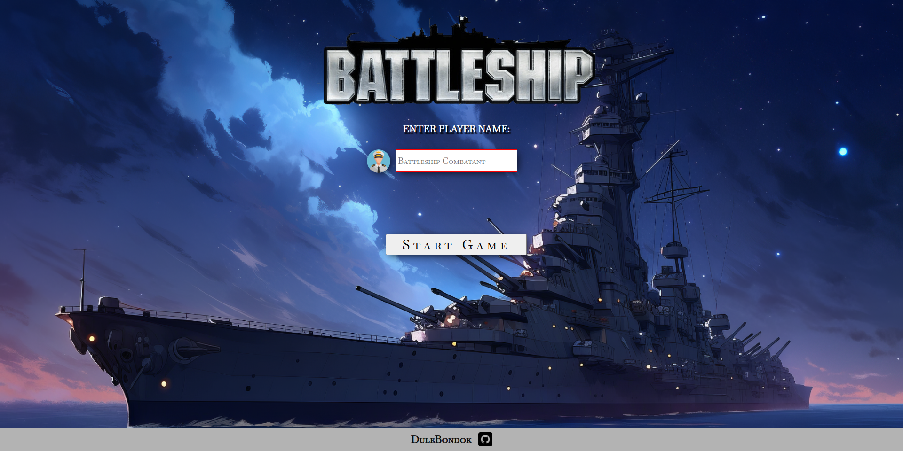

# BattleShip Game
Single player battleship game with a short storyline.
This project is made with vanilla JS, HTML and CSS.
It has start screen where user needs to input his name in order to start a game.
After starting the game, user places his ships on board and plays game by clicking on enemy board until he destroys all enemy ships.
After player attacks enemy board, computer attacks his board randomly.

[Play the game](https://dulebondok.github.io/battleship-game/)

## Features
- Optional ship placement
- Random enemy attacks
- Text generating after ship is hit

**🧭 Possible Future Implementations**
- Ability for player to place ships on y-axis
- More board settings such as size, colors, obstacles etc.
- Multiplayer mode
- Implementing AI for computer plays

## 💻 Built With

